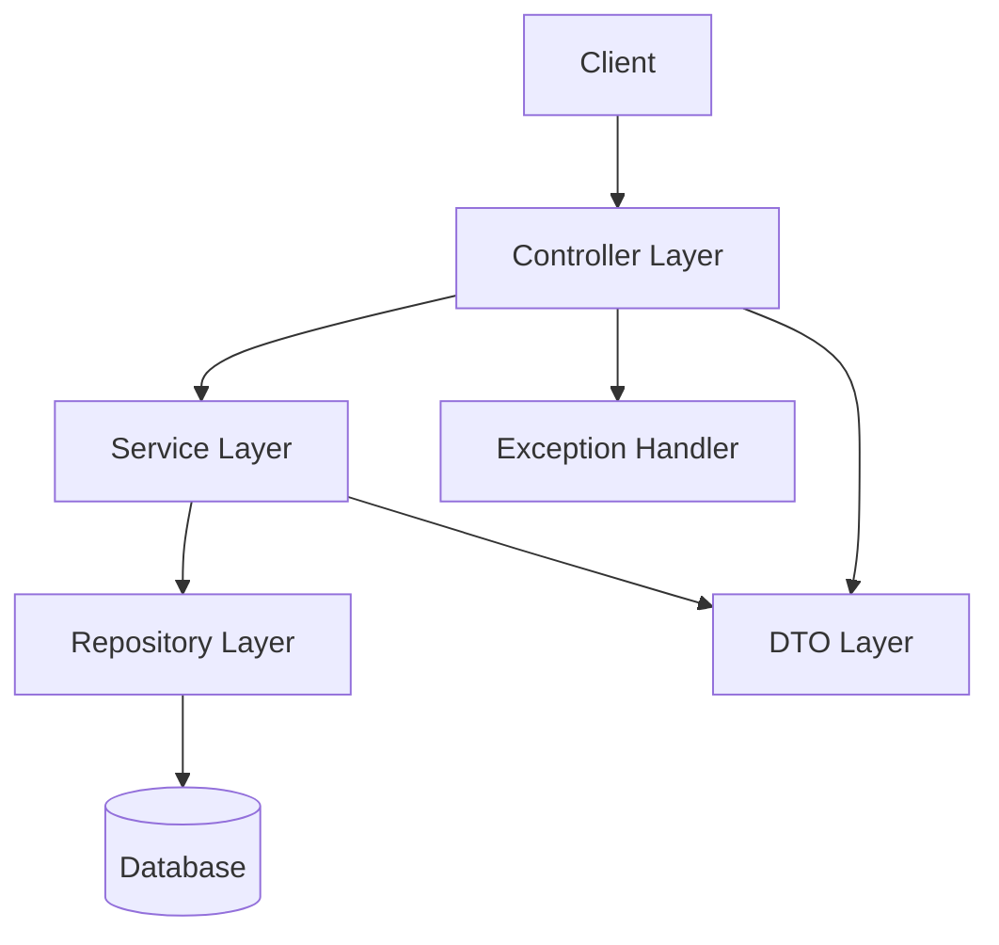
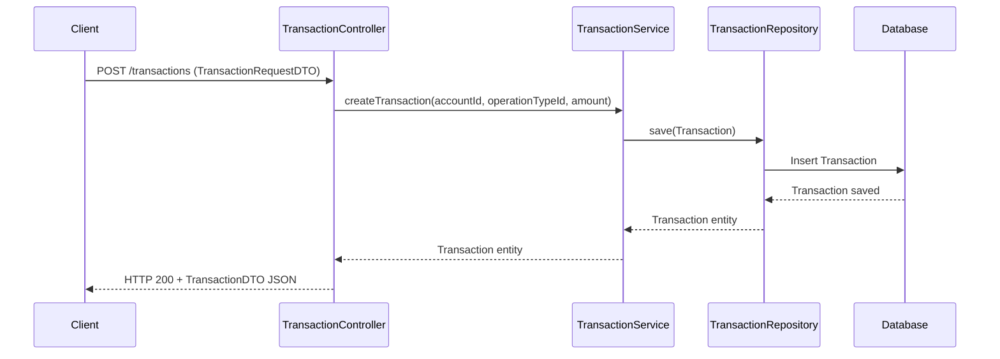

# Mini Bank Project Documentation

## Table of Contents
- [Project Overview](#project-overview)
- [Architecture Overview](#architecture-overview)
- [Layered Structure](#layered-structure)
  - [Controller Layer](#controller-layer)
  - [Service Layer](#service-layer)
  - [Repository Layer](#repository-layer)
  - [Entity Layer](#entity-layer)
  - [DTO Layer](#dto-layer)
  - [Exception Handling](#exception-handling)
- [Component Diagram](#component-diagram)
- [Sequence Diagram: Transaction Creation](#sequence-diagram-transaction-creation)
- [Javadoc API Documentation](#javadoc-api-documentation)

---

## Project Overview

Mini Bank is a Spring Boot-based backend application that provides RESTful APIs for basic banking operations such as account management and transaction processing. The project follows a clean, layered architecture for maintainability and testability.

## Architecture Overview

The application is structured in a typical multi-layered architecture, separating concerns between web, business, and data access logic.

## Layered Structure

### Controller Layer
- **Responsibility:** Exposes REST endpoints, handles HTTP requests/responses, performs DTO validation and mapping, and delegates business logic to the service layer.
- **Location:** `com.ashisht.mini_bank.controller`
- **Key Classes:**
  - `AccountController`: Manages account-related endpoints. Handles DTO validation and mapping. Only passes required parameters (e.g., `documentNumber`) to the service layer.
  - `TransactionController`: Manages transaction-related endpoints.
  - `GlobalExceptionHandler`: Handles exceptions globally for REST APIs.

### Service Layer
- **Responsibility:** Contains business logic, validation, and orchestrates data access. Only receives primitive or required parameters, not DTOs, from the controller layer.
- **Location:** `com.ashisht.mini_bank.service`
- **Key Classes:**
  - `AccountService`: Interface for account operations. Methods accept only required parameters (e.g., `String documentNumber`).
  - `TransactionService`: Interface for transaction operations.
  - `AccountServiceImpl`, `TransactionServiceImpl`: Implementations of the above interfaces.

### Repository Layer
- **Responsibility:** Handles data persistence and retrieval using Spring Data JPA.
- **Location:** `com.ashisht.mini_bank.repository`
- **Key Classes:**
  - `AccountRepository`, `TransactionRepository`, etc.

### Entity Layer
- **Responsibility:** Contains JPA entity classes representing database tables.
- **Location:** `com.ashisht.mini_bank.entity`
- **Key Classes:**
  - `Account`, `Transaction`, `OperationType`, etc.

### DTO Layer
- **Responsibility:** Data Transfer Objects for request and response payloads. Used only in the controller layer for validation and mapping.
- **Location:** `com.ashisht.mini_bank.web.request`, `com.ashisht.mini_bank.web.response`
- **Key Classes:**
  - `AccountDTO`, `TransactionRequestDTO`, `AccountResponseDTO`, etc.
  - `TransactionDTO`: Response DTO for transaction creation, containing transactionId, accountId, operationTypeId, amount, and message.
  - `AccountDTO`, `AccountResponseDTO`: DTOs for account-related requests and responses. Used only in the controller layer.

#### DTO Mapping
- **Responsibility:** Converts entities to DTOs for API responses.
- **Location:** `com.ashisht.mini_bank.mapper`
- **Key Classes:**
  - `TransactionMapper`: Maps `Transaction` entities to `TransactionDTO` for clean API responses.
  - `AccountMapper`: Maps `Account` entities to `AccountDTO` and `AccountResponseDTO` for account API responses.

### Exception Handling
- **Responsibility:** Centralized error handling for REST APIs.
- **Location:** `com.ashisht.mini_bank.controller.GlobalExceptionHandler`
- **Key Features:**
  - Handles `IllegalArgumentException` and returns HTTP 400 with error message.

## Component Diagram



## Sequence Diagram: Transaction Creation



## Transaction API Response and Mapping

The `POST /transactions` endpoint creates a new transaction and returns a response in the form of a `TransactionDTO`:

```json
{
  "transactionId": 123,
  "accountId": 456,
  "operationTypeId": 1,
  "amount": 100.0,
  "message": "SUCCESS"
}
```

The mapping from the internal `Transaction` entity to the `TransactionDTO` is handled by the `TransactionMapper` class (`src/main/java/com/ashisht/mini_bank/mapper/TransactionMapper.java`). This ensures a clean separation between entity and API response.

## Account API Request Handling and Service Layer

The `POST /accounts` endpoint accepts an `AccountDTO` in the request body for validation purposes. However, only the required parameter (`documentNumber`) is passed to the service layer. The service layer does not depend on DTOs and only receives primitive or required parameters. All DTO validation and mapping are handled in the controller layer.

**Example:**

```json
POST /accounts
{
  "documentNumber": "1234567890"
}
```

The controller extracts `documentNumber` from the DTO and passes it to the service:

```java
Account account = accountService.createAccount(accountDTO.getDocumentNumber());
```

The service layer creates and returns the Account entity, and the controller maps it to `AccountResponseDTO` for the API response.

---

For more details, see the source code and README.md for build and operational instructions.
