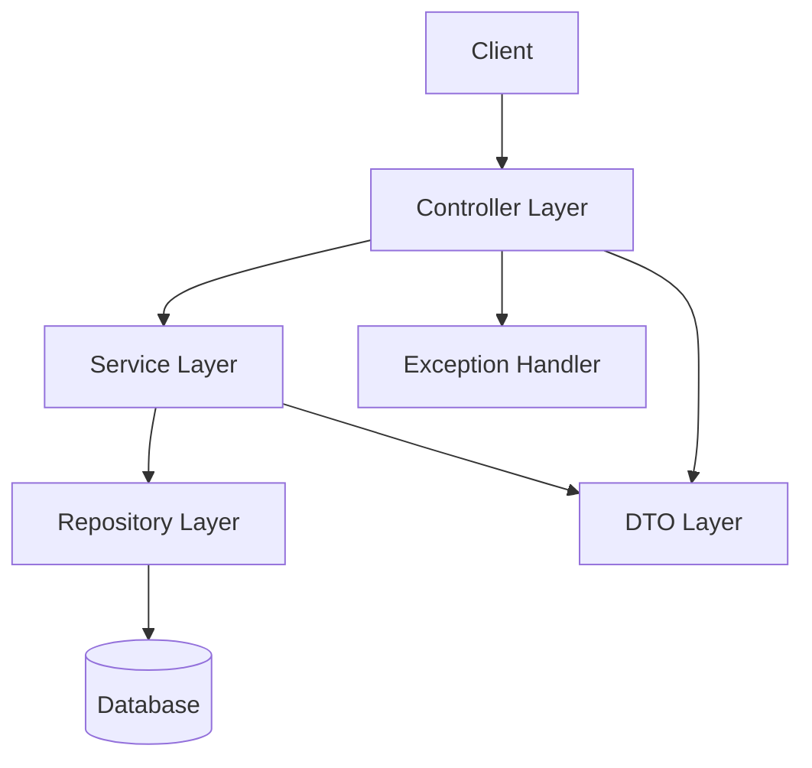
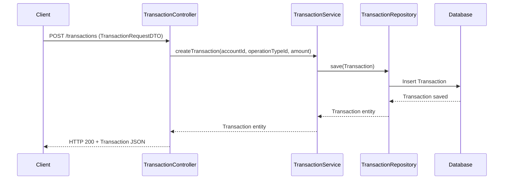

# Mini Bank Project Documentation

## Table of Contents
- [Project Overview](#project-overview)
- [Architecture Overview](#architecture-overview)
- [Layered Structure](#layered-structure)
  - [Controller Layer](#controller-layer)
  - [Service Layer](#service-layer)
  - [Repository Layer](#repository-layer)
  - [Entity Layer](#entity-layer)
  - [DTO Layer](#dto-layer)
  - [Exception Handling](#exception-handling)
- [Component Diagram](#component-diagram)
- [Sequence Diagram: Transaction Creation](#sequence-diagram-transaction-creation)

---

## Project Overview

Mini Bank is a Spring Boot-based backend application that provides RESTful APIs for basic banking operations such as account management and transaction processing. The project follows a clean, layered architecture for maintainability and testability.

## Architecture Overview

The application is structured in a typical multi-layered architecture, separating concerns between web, business, and data access logic.

## Layered Structure

### Controller Layer
- **Responsibility:** Exposes REST endpoints, handles HTTP requests/responses, and delegates business logic to the service layer.
- **Location:** `com.ashisht.mini_bank.controller`
- **Key Classes:**
  - `AccountController`: Manages account-related endpoints.
  - `TransactionController`: Manages transaction-related endpoints.
  - `GlobalExceptionHandler`: Handles exceptions globally for REST APIs.

### Service Layer
- **Responsibility:** Contains business logic, validation, and orchestrates data access.
- **Location:** `com.ashisht.mini_bank.service`
- **Key Classes:**
  - `AccountService`: Interface for account operations.
  - `TransactionService`: Interface for transaction operations.
  - `AccountServiceImpl`, `TransactionServiceImpl`: Implementations of the above interfaces.

### Repository Layer
- **Responsibility:** Handles data persistence and retrieval using Spring Data JPA.
- **Location:** `com.ashisht.mini_bank.repository`
- **Key Classes:**
  - `AccountRepository`, `TransactionRepository`, etc.

### Entity Layer
- **Responsibility:** Contains JPA entity classes representing database tables.
- **Location:** `com.ashisht.mini_bank.entity`
- **Key Classes:**
  - `Account`, `Transaction`, `OperationType`, etc.

### DTO Layer
- **Responsibility:** Data Transfer Objects for request and response payloads.
- **Location:** `com.ashisht.mini_bank.web.request`, `com.ashisht.mini_bank.web.response`
- **Key Classes:**
  - `AccountDTO`, `TransactionRequestDTO`, `AccountResponseDTO`, etc.

### Exception Handling
- **Responsibility:** Centralized error handling for REST APIs.
- **Location:** `com.ashisht.mini_bank.controller.GlobalExceptionHandler`
- **Key Features:**
  - Handles `IllegalArgumentException` and returns HTTP 400 with error message.

## Component Diagram

## Sequence Diagram: Transaction Creation

---

For more details, see the source code and README.md for build and operational instructions.

